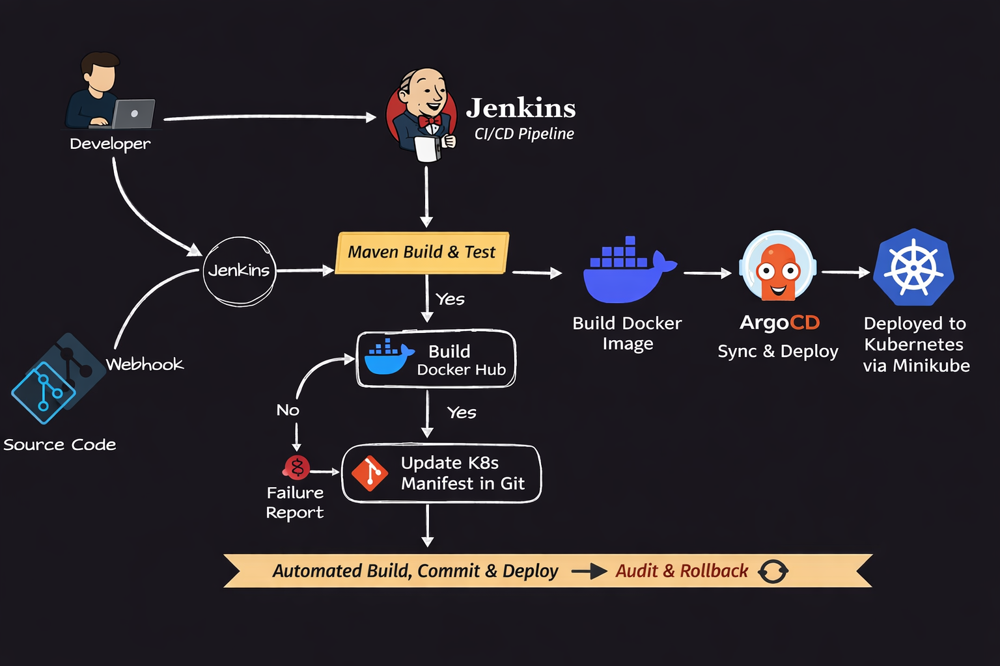
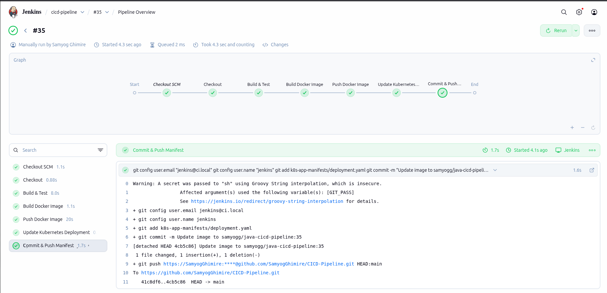
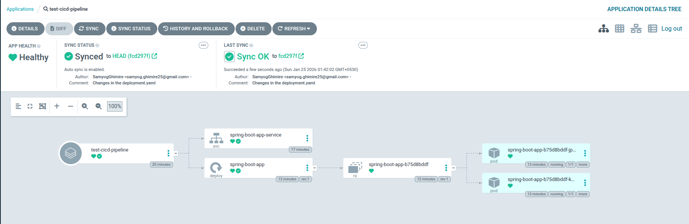
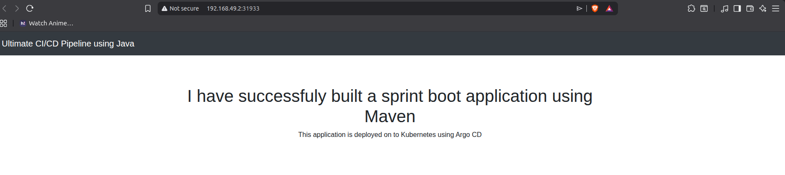

# CICD Pipeline Project

## Prerequisites:
- Jenkins
- Git/GitHub
- Maven
- Docker
- ArgoCD (GitOps)
- Kubernetes (Minikube)

## Architecture

## Description
In this CI/CD Pipeline Project we use Jenkins for CI (Continuous Integration) and GitOps for CD (Continuous Delivery) of a java application. Application source code lives in Git repo and Kubernetes manifests live in another.
Jenkins builds and pushes the image to a container registry using Docker.
Argo Image Updater detects a new image and updates Git. ArgoCD watches Git and deploys changes to Kubernetes ensuring Git is always the source of truth.

## CI/CD Pipeline Flow

### 1. Code Commit  
Developer pushes code changes to the GitHub repository.

---

### 2. GitHub Webhook Trigger  
A GitHub webhook immediately notifies Jenkins about the new commit, avoiding continuous polling.

---

### 3. Jenkins CI Pipeline  
Jenkins starts the CI pipeline defined in the declarative `Jenkinsfile`.

---

### 4. Maven Build & Test  
Jenkins runs Maven to:  
- Compile the Spring Boot application  
- Resolve dependencies  
- Execute unit tests  
If the build or tests fail, the pipeline stops.

---

### 5. Docker Build & Push  
Jenkins:  
- Builds a Docker image for the application  
- Tags it with the Jenkins build number  
- Pushes the image to Docker Hub

---

### 6. Manifest Update (GitOps)  
Jenkins updates the Kubernetes deployment manifest with the new Docker image tag and commits the change back to Git, keeping Git as the single source of truth.

---

### 7. ArgoCD Sync  
ArgoCD detects the updated manifest in Git and automatically syncs the changes to the Kubernetes cluster.

---

### 8. Deployment to Kubernetes  
The new application version is rolled out to Minikube automatically using Kubernetes rolling updates.

---

### 9. Audit & Rollback  
All deployment changes are tracked in Git.  
If an issue occurs, rolling back is as simple as reverting a Git commit, and ArgoCD will automatically apply the previous state.

---

## Output Screenshot:

### Jenkins Pipeline (Successful Build)

### ArgoCD Application (Successful Sync)

### Deployed Application (Minikube IP)

---

## Key Learnings

- End-to-end CI/CD automation  
- GitOps with ArgoCD  
- GitHub webhook–triggered Jenkins builds  
- Docker image versioning best practices  
- Automated Kubernetes rollouts  
- Git-based audit & rollback  

---
