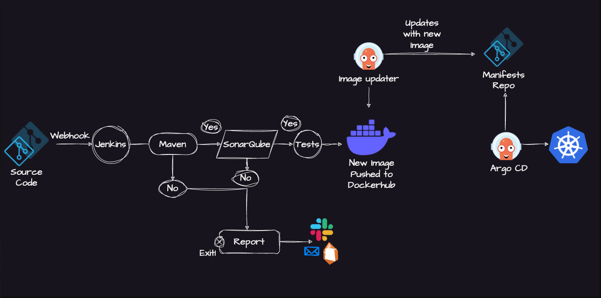

# CICD Pipeline Project

## Prerequisites:
- Jenkins
- Git/GitHub
- Maven
- Docker
- ArgoCD (GitOps)
- Helm
- Kubernetes

## Architecture

## Description
In this CI/CD Pipeline Project we use Jenkins for CI (Continuous Integration) and GitOps for CD (Continuous Delivery) of a java application. Application source code lives in Git repo and Kubernetes manifests live in another.
Jenkins builds and pushes the image to a container registry using Docker.
Argo Image Updater detects a new image and updates Git. ArgoCD watches Git and deploys changes to Kubernetes ensuring Git is always the source of truth.

## Step By Step CICD Pipeline Flow

#### 1. **Code Commit in Git**
- Developers push changes to the application Git repository.
- Git serves as the single source of truth for both application code and Kubernetes manifests.

---

#### 2. **Trigger Jenkins via GitHub Webhook**
- GitHub webhook triggers the Jenkins CI pipeline immediately after a commit, avoiding continuous polling.

---

#### 3. **Jenkins Starts Pipeline (Declarative Jenkinsfile)**
- The pipeline defined in the Declarative Jenkinsfile orchestrates all CI steps.

---

#### 4. **Maven Build & Test**
- Maven compiles the Java application and resolves dependencies.
- Maven runs unit tests and performs static code analysis.
- If Maven build fails, Jenkins sends an email notification to developers and stops the pipeline.

---

#### 5. **Docker Image Build & Push**
- If test passes, Jenkins builds a Docker image of the application.
- The image is tagged and pushed to the container registry (e.g., Docker Hub or private registry).

---

#### 6. **Argo Image Updater Updates Git**
- Argo Image Updater detects the new Docker image and updates the image tag in the Kubernetes manifests repository.
- This commit ensures Git remains the single source of truth.

---

#### 7. **ArgoCD Deploys to Kubernetes** 
- Runs inside the Kubernetes cluster.
- ArgoCD continuously monitors the manifests repository.
- Upon detecting the updated image tag, ArgoCD synchronizes the manifests with the Kubernetes cluster, deploying the new version automatically.

---

#### 8. **Audit & Rollback**
- Every change is tracked in Git, allowing auditable deployments.
- If a problem occurs, rolling back is as simple as reverting the Git commit, which ArgoCD automatically applies to the cluster.

---